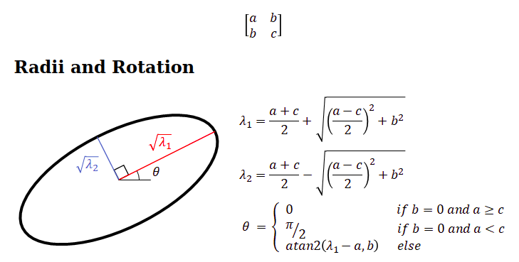
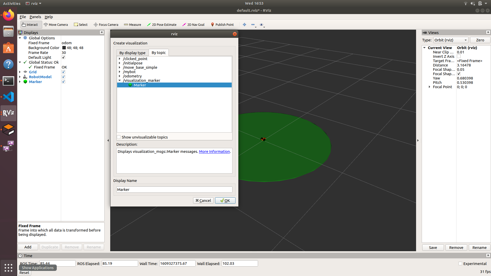
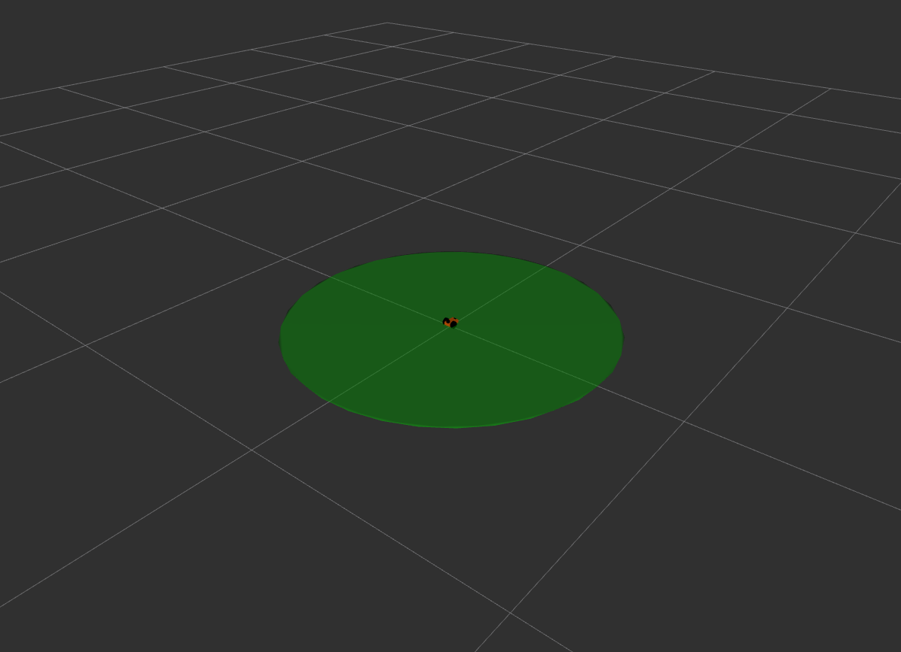
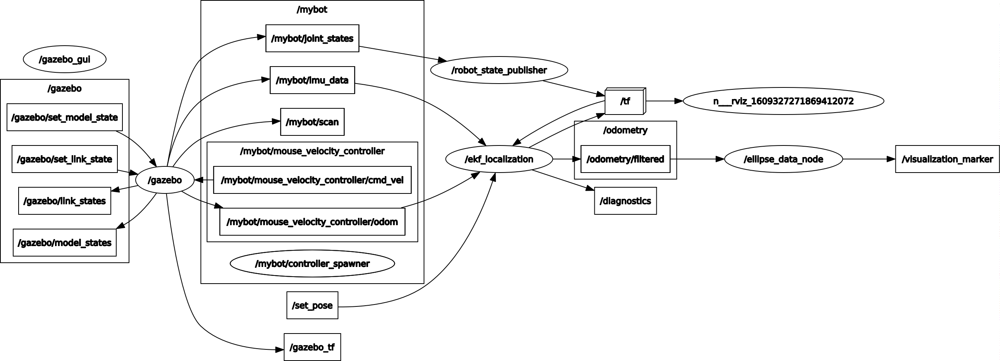

# Rviz-2D-Pose-Covariance-Ellipse

This script creates a node which subscribes from the Odometry data (in script from EKF_filtered/Odometry) 
and calculates the length of major and minor axis of 2D pose Covariance.

Then for RVIZ, a ellipse shaped marker is created with frame of footprint( bot base) therefore the pose is (0, 0, 0) wrt to robot.

This marker can can be visualized in the Rviz Add by topic section under Visualization_msg/Marker.

Once added the Covariance will appere below the robot

The Rqt_graph will not show any connection from visualization_msg to Rviz untill yoyu unhide Debug

Further, Script is full of comments DO check it out 
